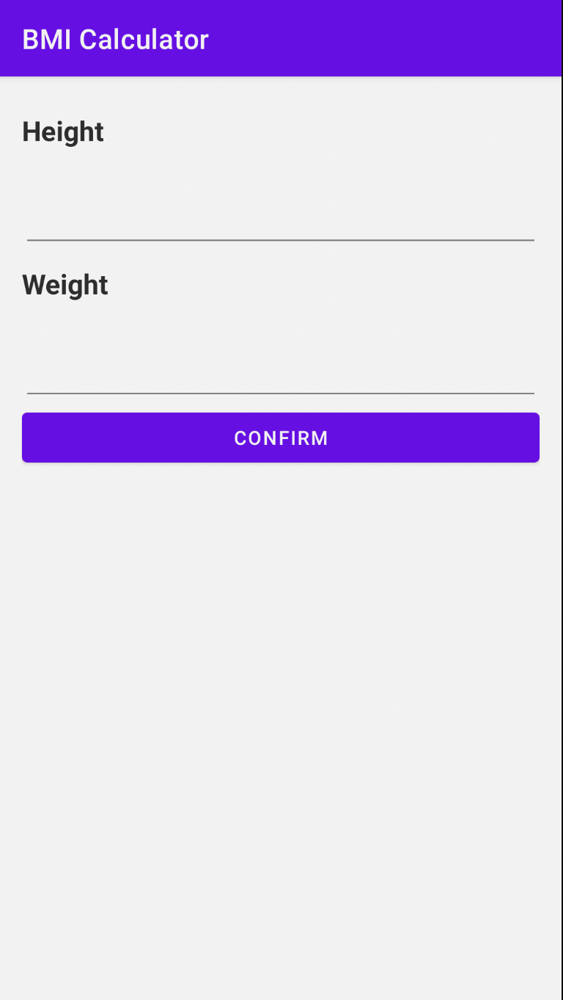
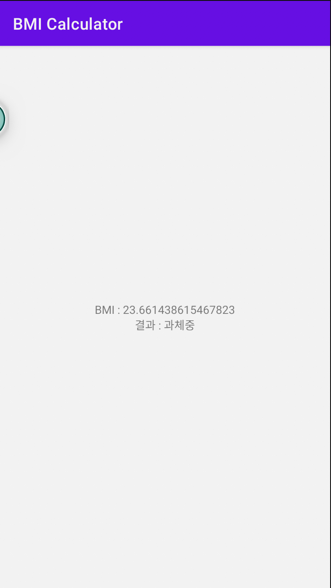

# BMI 계산기

# 결과화면

# 이 프로젝트를 통해 배우는 것

- **Layout** 을 그리는 법
  - **LinearLayout** 사용하기
  - **TextView** 의 속성들과 사용하는 법
  - **EditText** 의 속성들과 사용하는 법
  - **Button** 사용하는 법
- **Layout** 과 **Kotlin** 코드를 함께 사용하기
- **버그** 수정해보기
- **Activity** 에 대해 알아보기

### Kotlin 문법

when 분기문

람다함수

### BMI 계산하기

공식 =  몸무게(kg) / (키 (m) * 키 (m)) 

18.5 이하면 저체중

18.5 ~ 23 은 정상체중

23 ~ 25는 과체중

25 ~ 30 은 경도 비만

30 ~ 35 는 중정도비만

35 이상은 고도 비만